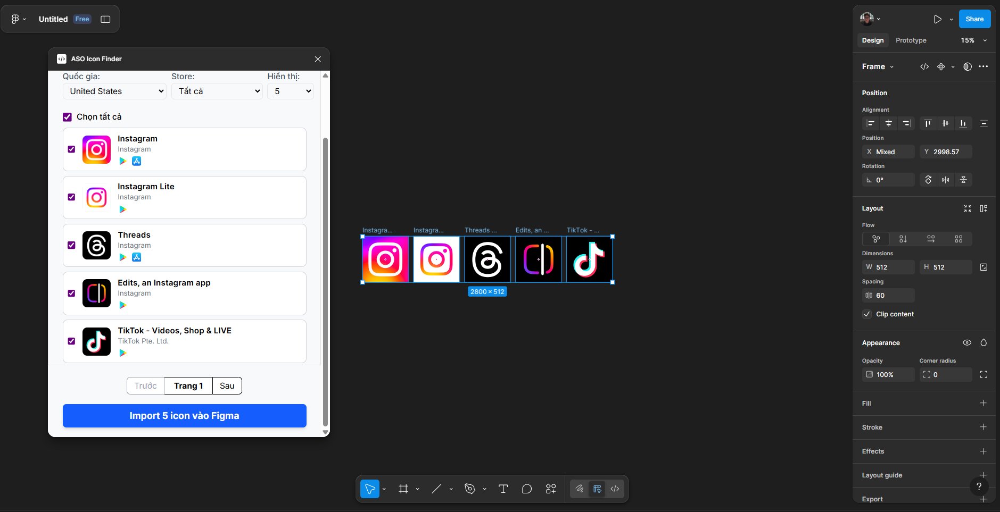

# Figma ASO Icon Finder

Plugin Figma sử dụng [google-play-scraper](https://github.com/facundoolano/google-play-scraper) và [app-store-scraper](https://github.com/facundoolano/app-store-scraper) giúp tìm kiếm và import icon ứng dụng từ Google Play Store và Apple App Store vào Figma.



Ngoài ra project này sử dụng server **Vercel** để fetch thông tin về plugin.


---

## Hướng dẫn cài đặt & build

### 1. Yêu cầu

- Node.js >= 16
- npm

### 2. Cài đặt các thư viện

Mở terminal tại thư mục dự án và chạy:

```bash
npm install
```

### 3. Thiết lập biến môi trường

Tạo file `.env` ở thư mục gốc (nếu chưa có) với nội dung:

```env
VERCEL_API_BASE_URL=your_vercel_url
FIGMA_PLUGIN_API_KEY=your_api_key
```

### 4. Build plugin

Chạy lệnh sau để build mã nguồn:

```bash
npm run build
```

File build sẽ nằm trong thư mục `dist/`.

### 5. Cài đặt vào Figma

1. Mở Figma → Plugins → Development → Import plugin from manifest...
2. Chọn file `manifest.json` trong thư mục dự án.

### 6. Sử dụng

- Mở plugin trong Figma.
- Nhập tên ứng dụng cần tìm kiếm icon.
- Chọn icon và nhấn "Import icon vào Figma".

---
## TODO
- Một vài logic UI vẫn hoạt động chưa đúng - will fix later

---
*Làm product thì push thẳng lên main*

*Ai sợ thì đi về...*